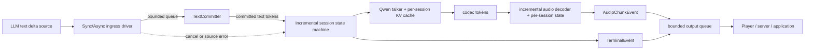

# Qwen3-TTS 对接 LLM 文本流：生产化实施计划

> 状态：Draft<br>
> 最后更新：2026-07-11<br>
> 当前实验分支：`codex/qwen3-tts-incremental-session`<br>
> 当前实验提交：`45908b2`、`7493689`<br>
> 推荐迁移基线：[`Blaizzy/mlx-audio@64e8416c`](https://github.com/Blaizzy/mlx-audio/commit/64e8416c303fb3b3463dab8eb4ebd78c55a87c1a)（2026-07-10 的官方 `main`）<br>
> 目标模型：Qwen3-TTS CustomVoice；后续再评估 Base/VoiceDesign

## 1. 摘要

当前分支已经验证了核心设想：在同一个 Qwen3-TTS talker KV cache 上，文本可以以 append-only 方式陆续到达，模型可以暂停、继续并持续输出音频，而不必把每个句子当成一个新 TTS 请求。

这项能力目前仍不存在于 upstream。官方的 streaming 是“完整文本已经给定后，分块输出音频”；官方 [Issue #441](https://github.com/Blaizzy/mlx-audio/issues/441) 仍在跟踪“接收 LLM text stream”的需求。[PR #537](https://github.com/Blaizzy/mlx-audio/pull/537) 所称的 incremental decoding 只优化新增音频 codec token 的解码，不是新增文本输入。

实验实现证明了模型路径可行，但尚不适合直接作为生产 API，主要原因如下：

- 固定保留 4 个 tokenizer token 不能保证 BPE 边界稳定，真实 LLM delta 会触发异常。
- append 失败不是原子操作，session 会留下互相矛盾的状态。
- codec ID `0` 被误当成 padding，可能裁掉合法音频。
- EOS 或 max-limit 恰好落在 chunk 边界时，消费者收不到 terminal chunk。
- 同步 wrapper 存在零步长 busy-loop，也不能直接消费常见的 `AsyncIterable[str]`。
- 当前分支落后于官方 Qwen3-TTS 的增量 vocoder、cache、sampling 和 continuous batching 改进。

本计划采用“先迁移新基线，再修正确性，再做性能与接口”的顺序。核心 Python session 是第一交付目标；异步 driver 和网络协议在核心稳定后交付。

## 2. 已验证基线

### 2.1 Upstream 现状

- 官方 Qwen3-TTS 入口仍是 [`generate(text: str, ...)`](https://github.com/Blaizzy/mlx-audio/blob/64e8416c303fb3b3463dab8eb4ebd78c55a87c1a/mlx_audio/tts/models/qwen3_tts/qwen3_tts.py#L1138-L1153)。
- 官方 streaming 文档描述的是完整文本输入后的音频 chunk 输出。
- HTTP `/v1/audio/speech` 请求仍接收单个 `input: str`。
- continuous batching 接受多个完整文本请求，不支持向同一个请求继续 append 文本。
- 当前实验分支只配置了 fork `jiangwei221/mlx-audio`，没有独立的官方 `upstream` remote。

### 2.2 当前实现范围

当前功能主要位于：

- `mlx_audio/tts/models/qwen3_tts/qwen3_tts.py`
  - `Model.start_custom_voice_session()`
  - `Model.generate_custom_voice_incremental()`
  - `IncrementalCustomVoiceSession`
- `mlx_audio/tts/models/qwen3_tts/__init__.py`
- `mlx_audio/tts/models/qwen3_tts/README.md`
- `mlx_audio/tts/tests/test_qwen3_tts.py`

当前语义是 append-only、单 KV cache、禁止 rollback，并提供 `pause`、`pad`、`pause_catchup` 三种等待策略。

两个实验提交以 `1de2a07` 为共同基线，只改动上述 4 个文件，合计约 +1435/-4；其中大量代码直接嵌入旧版 `qwen3_tts.py`。截至本文日期，官方在该共同基线之后已有约 506 个提交，Qwen 核心至少经历 9 次后续修改。这也是本计划选择“行为重移植”而不是“大提交冲突合并”的依据。

### 2.3 实模结果

模型路径：

```text
/Volumes/Crucial X10/data/audio/Qwen3-TTS-12Hz-1.7B-CustomVoice
```

已验证：

- 现有 Qwen3-TTS 测试 35/35 通过。
- `Hello world.`、temperature 0：
  - 普通 streaming 与“完整文本一次 append、随后 finalize”的增量 session 都生成 17 个 codec token、32640 samples。
  - 两者音频 SHA 相同，warm TTFB 约 155 ms，总耗时约 0.91 s。
- streaming 音频拼接与 offline 全量解码长度相同，MAE 约 `4e-8`。
- pause → append → finalize 过程中：
  - 空 pump 不推进 codec、不重复输出。
  - talker KV cache 对象保持不变。
  - 最终可以自然 EOS。
- 同一句话按两次 append 与整句输入得到 34 vs 33 个 codec token，公共区间 MAE 约 `0.0678`。

最后一项不是简单的实现错误：一旦音频已经播放，后到的标点、语气和词尾不能再改变已播放内容。这是低延迟与韵律质量之间必须显式管理的因果取舍。

## 3. 目标与非目标

### 3.1 必须实现的目标

1. 接受同步或异步的 append-only 文本 delta，并在同一个 talker KV cache 上继续生成。
2. 默认模式不能因为正常的 tokenizer 尾部重分词而中断普通 LLM 输出。
3. 所有 append 必须具备事务性：成功时全部生效，失败时 session 状态完全不变。
4. 音频必须有序、exactly-once；终止事件必须恰好出现一次。
5. 调用者必须能区分自然 EOS、空输入、达到 max limit、取消、源异常和内部异常。
6. pause 期间不得生成或重复音频；新文本到达后不得重置 talker KV cache。
7. 新文本必须能够抢占尚未 forward 的 catchup pad。
8. 音频 decoder 只处理新增 codec token，长会话的 decoder 成本不得随历史长度线性增长。
9. session 必须支持取消、close 和确定性的资源清理。
10. 不破坏现有完整文本 `generate()`、`generate_custom_voice()` 和音频 streaming API。

### 3.2 第二阶段目标

1. 提供 `AsyncIterable[str]` → async audio/event stream 的官方 Python driver。
2. 提供有界文本队列、有界音频队列和明确的 backpressure。
3. 提供实验性双向网络接口，使 LLM delta 与音频 chunk 能在一个会话中交换。
4. 建立可重复的延迟、质量、内存和长会话 benchmark。
5. 整理为可提交 upstream 的小型、模块化 PR。

### 3.3 暂不纳入本轮

- 支持修改或撤销已经 append 的文本。
- 对已经播放的音频做 rollback、重写或 cross-fade 替换。
- 第一阶段同时支持 Base voice cloning 与 VoiceDesign。
- 第一阶段支持多进程共享同一个 session。
- 以 waveform 完全相同作为任意 LLM 分片时序的质量要求。
- 修改现有 OpenAI-compatible `/v1/audio/speech` 的请求语义。

## 4. 设计原则与关键决策

### 4.1 从官方最新 `main` 重新移植

不在当前 2026-02-19 附近的旧 Qwen 文件上继续堆叠。创建一个以官方最新 `main` 为父节点的新分支，手工迁移 session 逻辑和测试，不直接 cherry-pick 两个大型提交。

原因：

- 官方 Qwen 文件在 batch、continuous batching、sampling、code cache、内存和 decoder 上已经有较大变化。
- 直接 rebase/cherry-pick 会把功能设计与机械冲突混在一起。
- 手工拆分到独立模块后，未来 upstream 冲突显著更小。

### 4.2 安全边界是默认策略

`stable_tail_tokens=N` 只能作为 legacy/experimental 模式，不能继续作为默认正确性保证。

默认使用基于 tokenizer offset 和已闭合 lexical span 的 `safe_word` commit policy：

- 保留当前尚未闭合的词、URL、数字或其他 tokenizer pre-token span。
- 空白作为下一 span 的潜在前缀时，不提前提交该空白。
- 只提交 offset 完全落在安全字符边界之前的 token。
- finalize 时提交全部剩余文本。
- 如果安全策略仍观察到 committed prefix 改变，视为内部 invariant failure，而不是普通调用者错误。

另提供：

- `safe_sentence`：等待句号、问号、感叹号、换行等更强边界，质量优先。
- `legacy_token_tail`：保留当前 N-token heuristic，只用于比较和兼容。

### 4.3 默认等待策略先采用 `pause`

在质量 corpus 完成前：

- `pause` 为默认。
- `pause_catchup` 保留为 opt-in experimental。
- `pad` 只保留兼容用途。

`pause_catchup` 的比例不能仅凭固定 `2.0 codec/text token` 决定；最终默认值必须由 corpus benchmark 给出。

### 4.4 核心 session 单 owner，异步 driver 负责串行化

session 本身不承诺线程安全。append、pump、finalize、cancel 必须由同一 owner 串行调用。

异步 driver 可以有独立的 LLM producer task，但所有模型与 session 操作必须在同一个专用执行上下文中顺序执行，不能让 producer thread 直接改 session。

### 4.5 终止是独立事件

不能依赖“最后一块音频刚好还剩数据”来表达终止。canonical API 使用独立 terminal event，因此即使 EOS 恰好落在音频 chunk 边界，也能无歧义结束。

## 5. 目标架构



### 5.1 组件职责

| 组件 | 责任 | 不负责 |
|---|---|---|
| `TextCommitter` | raw delta、token offset、安全边界、事务性 proposal | 模型 forward、音频 |
| `IncrementalCustomVoiceSession` | 状态机、talker cache、采样调度、终止 | 并发读取 LLM |
| `StreamingDecoderState` | conv buffer、decoder KV、增量 codec → PCM | 文本策略 |
| sync driver | 消费 `Iterable[str]`、协调 append/pump | 后台并发 |
| async driver | producer、bounded queue、backpressure、cancel | 修改 session 内部状态 |
| server adapter | 网络消息、PCM framing、会话生命周期 | 重新实现模型状态机 |

### 5.2 推荐文件布局

```text
mlx_audio/tts/models/qwen3_tts/
├── qwen3_tts.py                 # Model 与现有完整文本生成路径
├── incremental.py               # session、状态机、事件、sync driver
├── text_commit.py               # commit policy 与事务性 tokenizer 逻辑
├── streaming_decoder_state.py   # 如果无法直接复用 upstream 显式状态 API
└── __init__.py

mlx_audio/tts/tests/
├── test_qwen3_tts.py
├── test_qwen3_tts_text_commit.py
├── test_qwen3_tts_incremental.py
├── test_qwen3_tts_incremental_async.py
└── test_qwen3_tts_incremental_live.py

examples/
└── qwen3_tts_llm_stream.py

benchmarks/qwen3_tts_incremental/
├── run.py
├── compare.py
├── corpus.jsonl
├── schedules.json
└── thresholds.json
```

## 6. 详细设计

### 6.1 `TextCommitter` 数据模型

建议维护：

```python
@dataclass(frozen=True)
class TextCommitSnapshot:
    raw_text: str
    sealed_char_end: int
    sealed_token_ids: tuple[int, ...]
    consumed_token_count: int
    ready_token_ids: tuple[int, ...]
    unstable_suffix: str
    version: int


@dataclass(frozen=True)
class AppendResult:
    accepted_chars: int
    newly_sealed_tokens: int
    sealed_tokens_total: int
    consumed_tokens_total: int
    buffered_chars: int
```

必须区分三个概念：

- sealed：tokenization 已经稳定，未来 append 不应改变。
- consumed：已经进入 talker KV cache，绝对不可 rollback。
- unstable：仍可能因为右侧上下文重新 tokenize。

`ready_token_ids` 等于 sealed 但尚未 consumed 的 token，运行时使用 `deque`，避免 `list.pop(0)`。实现中可以用 chunk list 避免反复执行 `full_text += delta`；对外 status 再按需 join。

### 6.2 去除魔法切片

当前 `token_ids[3:-5]` 假设 chat template 前后 token 数永远不变。新实现应：

1. 对完整 chat 文本请求 `return_offsets_mapping=True`。
2. 记录正文在 chat 字符串中的起止 offset。
3. 选择与正文字符区间相交的 token。
4. 对目标 tokenizer/version 加启动时自检。

chat suffix（例如 `<|im_end|>`）不能被当成“用户正文已经闭合”的证据；未 finalize 时，正文最后一个可能继续扩展的 pre-token span 必须继续保留。

如果 tokenizer backend 不支持 offset mapping，则：

- safe policy 启动失败并给出清晰错误；或
- 使用经过单测验证的 tokenizer pre-tokenizer span API。

不得静默退回固定 token slice。

### 6.3 事务性 append

`append_text(delta)` 的推荐流程：

```python
def append_text(delta: str) -> AppendResult:
    validate_session_accepts_text()
    validate_delta(delta)

    candidate_text = old_text + delta
    candidate_encoding = tokenize_with_offsets(candidate_text)
    safe_char_end = commit_policy.safe_prefix_end(
        candidate_text,
        candidate_encoding.offsets,
        finalized=False,
    )
    candidate_sealed_end = token_end_at_or_before(safe_char_end)
    candidate_sealed_ids = candidate_encoding.ids[:candidate_sealed_end]

    # 已 sealed 的 prefix 永远不能改变或缩短。
    validate_sealed_prefix(
        old.sealed_token_ids,
        candidate_sealed_ids,
    )

    newly_sealed_ids = candidate_sealed_ids[
        len(old.sealed_token_ids):
    ]
    new_embeddings = embed(newly_sealed_ids)
    mx.eval(new_embeddings)

    ready_ids = old.ready_token_ids + newly_sealed_ids

    # 上面任何一步失败都不能修改 self。
    commit_all_candidate_fields_atomically()
    return append_result
```

必须满足：

- append 成功后，`raw_text`、sealed IDs、ready IDs、offset/char boundary 与 embeddings 同属一个 snapshot。
- append 失败后，上述字段及状态枚举逐项不变。
- 空字符串 append 是幂等 no-op。
- 非字符串、finalize 后 append、terminal 后 append 使用不同的明确异常类型。

session 消费一个 ready token 时，单独、原子地递增 `consumed_token_count` 并从 deque 取出对应 token/embedding。legacy token-tail 模式若只观察到未 sealed 尾部缩短，但 consumed prefix 未变，应保持 consumed 边界并等待更多文本，不能因为 `len(ids)-tail < consumed` 直接报错。

`finalize_text()` 也走同一 prepare/commit 事务：先在局部 snapshot 中把全部 unstable suffix seal，验证最终 IDs 与 one-shot chat-body tokenization 完全一致，完成 embedding 后再把 session 切到 FINALIZING。不能先设置 `text_finalized=True` 再执行可能失败的 tokenizer/embedding。

### 6.4 安全边界策略

#### `safe_word`

- 使用 tokenizer pre-tokenizer/offset 识别最后一个尚未闭合 span。
- 提交最后一个未闭合 span 之前的所有完整 token。
- 对 `Hello `，提交 `Hello`，把可能属于下一个 token 的空格留在 raw tail。
- 对 URL、邮箱、长数字、snake_case 和连续字母，在出现可确认边界前继续缓冲。
- 不对文本做隐式 Unicode normalization。

#### `safe_sentence`

- 只在强标点、换行或调用者显式 flush hint 后提交。
- 标点后需要最小 lookahead，避免引号、组合标点仍在变化。
- 用于播报、长句和韵律优先场景。

#### `legacy_token_tail`

- 明确标注不保证 no-rollback。
- 默认不开启。
- invariant 被破坏时以 `FAILED/internal_error` 终止，不留下可继续使用的半污染 session。

#### 超长未闭合 span

配置：

- `max_uncommitted_chars`
- `max_input_chars`
- `uncommitted_overflow_policy`

默认策略是显式失败或施加 producer backpressure，不能静默切换到有损提交。是否允许 `fallback_legacy_tail` 必须由调用者显式选择。

### 6.5 Session 状态机

稳定状态：

| 状态 | 含义 | 允许操作 |
|---|---|---|
| `OPEN` | 文本入口开放，可能有待消费 token | append、pump、finalize、cancel |
| `WAITING_TEXT` | 文本入口开放，但没有可消费 token | append、pump(no-op)、finalize、cancel |
| `FINALIZING` | 输入关闭，正在消费尾部/EOS | pump、cancel |
| `FINISHED` | 自然 EOS 或空输入 | status、close |
| `TRUNCATED` | 达到 codec/text/session limit | status、close |
| `CANCELLED` | 主动取消 | status、close |
| `FAILED` | source/tokenizer/model/decoder 异常 | status、close |

`pump()` 执行期间使用 reentrancy guard；`RUNNING` 不必作为对外稳定状态。

关键转换：

| 当前状态 | 事件 | 下一状态 |
|---|---|---|
| OPEN/WAITING_TEXT | append 产生稳定 token | OPEN |
| OPEN | pump 消耗完可用 token | WAITING_TEXT |
| OPEN/WAITING_TEXT | finalize | FINALIZING |
| FINALIZING | audio EOS | FINISHED |
| 任意非 terminal | max codec steps | TRUNCATED |
| 任意非 terminal | cancel/close-before-finish | CANCELLED |
| 任意非 terminal | 未处理异常 | FAILED |

`is_finished()` 应改为或补充 `is_terminal()`。`eos_reached` 不能再表示 max-limit。

### 6.6 Finish reason

```python
class FinishReason(str, Enum):
    EOS = "eos"
    EMPTY_INPUT = "empty_input"
    MAX_CODEC_STEPS = "max_codec_steps"
    MAX_INPUT = "max_input"
    CANCELLED = "cancelled"
    SOURCE_ERROR = "source_error"
    TOKENIZER_INVARIANT = "tokenizer_invariant"
    MODEL_ERROR = "model_error"
    DECODER_ERROR = "decoder_error"
```

status 至少返回：

- `state`、`finish_reason`
- received/committed/buffered chars
- total/consumed/pending text tokens
- codec tokens generated/decoded
- audio chunks/samples emitted
- waiting/catchup counters
- terminal event 是否已经发送
- 可选的结构化错误摘要，不包含原始用户文本

### 6.7 输出事件与 exactly-once

canonical API：

```python
@dataclass(frozen=True)
class AudioChunkEvent:
    sequence_no: int
    result: GenerationResult
    codec_start: int
    codec_end: int


@dataclass(frozen=True)
class TerminalEvent:
    sequence_no: int
    state: SessionState
    finish_reason: FinishReason
    status: SessionStatus


IncrementalEvent = AudioChunkEvent | TerminalEvent
```

规则：

1. `sequence_no` 从 0 单调递增。
2. 每个 codec token 只属于一个 audio event。
3. terminal event 恰好一次，且一定是最后一个 event。
4. terminal 不要求携带音频，因此 exact chunk boundary 不再是特殊情况。
5. terminal 之后所有 pump 都是幂等空输出。

兼容层可以继续返回 `GenerationResult`。若必须维持 `is_final_chunk`，在 exact-boundary 时输出一个明确记录为 terminal marker 的零 sample result；新代码应优先消费 typed event。

### 6.8 Canonical drive API：eager `advance()`

低层 canonical API 不应继续依赖“开始迭代 generator 时才真正修改 session”的 lazy `pump()`。这会让锁、防重入、取消、async worker、no-progress 检查以及调用者提前停止迭代时的清理都变得模糊。

推荐改为一次调用内完成有限工作：

```python
@dataclass(frozen=True)
class AdvanceOutcome:
    events: tuple[IncrementalEvent, ...]
    codec_steps: int
    text_tokens_consumed: int
    progressed: bool
    blocked_on_text: bool
    status: SessionStatus


def advance(self, *, max_codec_steps: int) -> AdvanceOutcome:
    ...
```

约束：

- `max_codec_steps` 必须是正整数；0 和负数立即 `ValueError`。
- 一次调用最多执行指定数量的 codec step。
- 返回前完成所有状态更新，并返回不可变 outcome。
- 没有推进时必须明确满足 `blocked_on_text` 或 terminal，不能让 wrapper 猜测。
- `_drive_active` 防止 append/finalize/cancel/advance 重入；重入抛 `SessionBusyError`。
- 每个 codec step 之间检查 cancel 和新到的真实 text。

现有 `pump()`/`pump_events()` 作为兼容 shim：先完整执行一次 `advance()`，再迭代 `outcome.events`。迭代期间不得继续修改 session；调用者即使只取一个 event 就停止，也不会留下半执行状态。

### 6.9 生成调度与 pad 抢占

当前代码会提前构造 `text_pad + codec_embed`，导致新文本不能抢占尚未执行的 pad。

重构为：

- 永远保存 `next_codec_embed`，不要提前把 text 与 codec 合成不可替换的 `next_input_embeds`。
- 每次 forward 前最后一刻执行：
  1. 优先取真实 pending text。
  2. 若 finalized，取 TTS text EOS 或 pad。
  3. 若未 finalized 且策略允许 catchup，取 pad。
  4. 否则进入 WAITING_TEXT。
- append 后只要下一步尚未 forward，真实文本必须覆盖 catchup pad。

`max_codec_steps_per_pump`：

- `None` 表示运行到当前策略的自然 yield 点。
- 整数必须 `> 0`。
- wrapper 每轮记录 codec/text/event 计数；没有进展且状态未改变时立即抛 `NoProgressError`，禁止 busy-loop。

### 6.10 EOS 与限制

- 文本 finalize 之前继续屏蔽 audio EOS，保持 append-only 语义。
- 文本 EOS 被消费后允许 audio EOS。
- 达到 `max_codec_steps_total` 时转为 TRUNCATED，而不是伪造 EOS。
- 如果输入仍开放却达到 max codec limit：
  - 立即发 terminal；
  - 停止消费 text source；
  - async driver 取消 producer；
  - 后续 append 返回 `SessionClosedError`。

### 6.11 增量音频 decoder

以 upstream #537 为基础，目标接口必须显式持有每 session 状态：

```python
decoder_state = decoder.new_streaming_state()
audio, decoder_state = decoder.streaming_step(
    new_codec_tokens,
    state=decoder_state,
)
decoder.close_streaming_state(decoder_state)
```

要求：

- 只传新增 codec token，不再外层加 context、内层又重复 context decode。
- talker KV cache、code-predictor cache 和 decoder state 都归单个 session；模型权重可以共享，生成状态不能共享。
- code-predictor cache 的 reset/reuse 复用 upstream 当前 helper，不恢复旧版“每 codec step 新建再删除”的路径。
- conv buffer、transformer KV cache、已输出 sample 数全部属于 session。
- 不在共享 model/decoder module 上保存会被另一个 session reset 的可变状态。
- codec `0` 是合法值；生成路径的有效长度由显式 token 数决定。
- decoder state 大小相对音频历史应为 O(1)；talker KV cache 按序列长度增长是预期行为。

如果第一版无法把 upstream decoder 的隐式 mutable state 改成显式 state，则必须：

- 每个已加载模型最多允许一个 active streaming-decoder session；
- 使用清晰的 session lease/lock；
- 第二个 session 立即得到容量错误，而不是互相污染音频。

### 6.12 同步 API

保留低层 session：

```python
with model.start_custom_voice_session(
    speaker="Ryan",
    language="English",
    commit_policy="safe_word",
    waiting_text_strategy="pause",
    streaming_interval=0.32,
) as session:
    for delta in llm_text_stream:
        session.append_text(delta)
        outcome = session.advance(max_codec_steps=4)
        for event in outcome.events:
            handle(event)

    session.finalize_text()
    while not session.is_terminal():
        outcome = session.advance(max_codec_steps=8)
        for event in outcome.events:
            handle(event)
```

保留 `generate_custom_voice_incremental(Iterable[str], ...)` 作为 convenience wrapper，但内部必须调用同一 event engine。

sync source 抛异常时，session 转为 FAILED/SOURCE_ERROR 并在 `finally` 清理；下游提前关闭 generator 时执行 cancel/close，不能只依赖 GC。

### 6.13 异步 API、backpressure 与取消

推荐入口：

```python
async for event in model.generate_custom_voice_from_stream(
    text_chunks=llm_async_stream,
    speaker="Ryan",
    language="English",
    commit_policy="safe_word",
):
    if isinstance(event, AudioChunkEvent):
        await player.write(event.result.audio)
    else:
        log_finish(event.finish_reason)
```

driver 结构：

- producer task 只读取 `AsyncIterable[str]` 并写入 bounded text queue。
- inference owner 从 queue 合并小 delta、调用 append，并以 1–4 codec step 的 quantum pump。
- bounded event/audio queue 把慢消费者的 backpressure 传回 inference。
- text queue 满时 producer await；不得无限缓存 LLM 输出。
- consumer 取消 async iterator 时：
  1. 取消 producer；
  2. session.cancel()；
  3. 发或记录 CANCELLED terminal；
  4. close talker/decoder state。
- source exception 默认导致 FAILED/SOURCE_ERROR；可选策略 `drain_on_source_error=True` 可以播完已经安全提交的文本，但必须显式配置。

### 6.14 网络接口

核心 Python API 稳定后新增实验端点，例如：

```text
WS /v1/audio/speech/stream
```

客户端控制消息：

- `start`：model、voice、language、采样参数、commit policy。
- `append`：sequence、text。
- `finalize`。
- `cancel`。

服务端消息：

- `ready`。
- audio metadata + binary PCM frame。
- `status`（可选、限频）。
- `terminal`：finish reason、计数、错误摘要。

第一版只支持 raw PCM/s16le 或 f32le。压缩格式必须使用跨 chunk 的持久编码器；不能把多个独立 WAV/MP3 文件字节简单拼接。

现有 `/v1/audio/speech` 保持不变，避免声称新协议是 OpenAI-compatible。

### 6.15 参数校验与资源上限

创建 session 时统一验证：

- `streaming_interval`：finite 且 `> 0`。
- temperature、top-p、min-p、top-k、repetition penalty 的有效范围；sampling 语义与 upstream 当前完整文本路径一致。
- `max_codec_steps_total > 0`。
- `max_codec_steps_per_pump is None or > 0`。
- catchup ratio finite 且 `> 0`。
- catchup budget `>= 0`。
- input char、session duration、idle timeout、queue item/char/sample 上限。

所有限制都必须映射到可观察的状态或明确异常，不得静默改值。

### 6.16 可观测性与隐私

记录结构化指标：

- session 创建、首个 delta、首个安全 boundary、首个 model forward、首个 audio event 的时间。
- text received/committed/buffered。
- codec/text lag、catchup steps、pause 次数与等待时长。
- talker TPS、decoder RTF、event queue wait。
- finish reason、错误类型、资源清理耗时。

默认不记录原始文本、token 内容或音频。debug 文本日志必须显式 opt-in，并清楚提示隐私风险。

## 7. Upstream 迁移策略

### 7.1 分支策略

推荐保留当前实验分支作为行为参考，创建新分支：

```bash
git remote add upstream https://github.com/Blaizzy/mlx-audio.git
git fetch upstream
git switch -c feat/qwen3-tts-llm-text-stream-v2 upstream/main
```

如果已经存在 `upstream` remote，只执行 fetch/switch。不得覆盖当前实验分支。

### 7.2 先保存可比较的基线

在迁移前提交或保存：

- deterministic all-text baseline 的 codec IDs、samples、SHA、TTFB。
- pause/resume/finalize 的状态 trace。
- tokenizer 失败向量。
- exact-boundary terminal、codec 0、zero-pump 的复现测试。
- benchmark 环境信息和 JSON 结果。

大型 WAV 和权重不提交 git；只提交小型 JSON/文本摘要和测试向量。

### 7.3 手工迁移，不整体 cherry-pick

| 当前改动 | 迁移方式 |
|---|---|
| model factory 方法 | 在官方新 `Model` 上添加极薄入口 |
| `IncrementalCustomVoiceSession` | 移到独立 `incremental.py` 后重写状态机 |
| tokenizer helpers | 由 `TextCommitter` 取代 |
| 当前音频 overlap decode | 不迁移，改用 upstream #537 |
| fake tests | 拆分、保留有价值的状态机测试 |
| README 示例 | 等 API 稳定后重写 |
| `pause_catchup` | 保留实验能力，但修复 pad 抢占并重新 benchmark |

### 7.4 重点冲突检查

1. 官方 Qwen 输入准备和 batch metadata 已重构，不能复制旧 `_prepare_generation_inputs`。
2. 官方 decoder 已有 streaming state/reset；必须确认其状态是否存放在共享 module。
3. 官方 code predictor cache 复用方式与当前每步 make/delete 不同。
4. 官方 sampling 过滤、EOS 和 max-token 逻辑已变化。
5. 官方 continuous batching 与新 session 命名/API 不能混淆。
6. 官方 `GenerationResult` 结构已经发生过修复，不能从旧分支覆盖。

### 7.5 Upstream 复用地图

| Upstream 变更 | 本计划如何处理 |
|---|---|
| [PR #534：Qwen3-TTS TTFB、单路/批量 helper](https://github.com/Blaizzy/mlx-audio/pull/534) | 复用当前 `_prepare_batch_inputs`、sampling、code prediction、codec embedding 等 helper；不要复制旧 generation loop |
| [PR #537：增量音频 decoder](https://github.com/Blaizzy/mlx-audio/pull/537) | 作为 codec → PCM 基础；进一步把 module 内 mutable buffer/KV 外置为 per-session state |
| [PR #674：continuous batching](https://github.com/Blaizzy/mlx-audio/pull/674) | 首版不依赖；它处理多个完整请求，不等于同一请求动态 append |
| [PR #685](https://github.com/Blaizzy/mlx-audio/pull/685) / [PR #689](https://github.com/Blaizzy/mlx-audio/pull/689)：ICL/ref cache 与 batch reference voice | CustomVoice 首版不直接使用，但迁移 context helper 时不得破坏这些路径 |
| [PR #735：temperature/min-p/top-p 修复](https://github.com/Blaizzy/mlx-audio/pull/735) | session 必须复用当前 `_sample_token` 并完整透传 `min_p`，不能搬旧 sampling |
| [Issue #720：batch session chunk/final 行为](https://github.com/Blaizzy/mlx-audio/issues/720) | 与 continuous scheduler 融合前单独解决或建立覆盖；不能假定现有 batch session 已经提供可靠 streaming terminal contract |

另外保留 upstream 后续的 streaming memory leak 修复，并把 10 分钟 live session 与重复创建/销毁 session 纳入验收。

### 7.6 Continuous batching 的后续融合

只有单 session、decoder state 隔离和 async driver 全部稳定后才开始：

1. 给每个 batch request 增加 OPEN/WAITING_TEXT/FINALIZING/terminal 状态。
2. scheduler 只把真正 READY 的 request 放进 GPU step；WAITING_TEXT 不占生成 slot。
3. 支持 append command、finalize command、cancel command 和动态 admission。
4. 验证 cache merge/extract、不同输入速率下的公平性，以及每 request terminal exactly once。
5. 先解决或规避 #720，再承诺小音频 chunk streaming。

这一阶段单独成 PR，不作为第一版 LLM text stream 的依赖。

### 7.7 建议的 upstream 提交拆分

内部功能完成后，不提交一个 1,400+ 行的巨型 PR。建议按 upstream 可独立接受的价值拆为：

1. 无争议 correctness：codec 0、终止契约、参数/no-progress 校验及测试。
2. decoder streaming state 显式化与并发隔离。
3. CustomVoice 单 session text append 核心。
4. sync/async text-stream driver。
5. 可选 server adapter。
6. 最后单独讨论 continuous batching text-stream。

每个 upstream PR 都附本阶段 benchmark 和回滚边界，避免核心能力因网络层或 scheduler 争议整体阻塞。

## 8. 实施拆分

以下每个 PR 都应可单独评审，且不把网络层和模型正确性混在一起。

| PR/里程碑 | 内容 | 依赖 | 预计工作量 |
|---|---|---|---|
| PR0：基线与复现 | 保存 live baseline；加入已知 bug 的 reproducer（目标修复前用带 bug ID 的 strict xfail）；建立 marker | 无 | 0.5–1.5 人日 |
| PR1：官方新基线 | 从 upstream main 建分支；拆出模块骨架；保持完整文本路径不变 | PR0 | 2–4 人日 |
| PR2：状态机与终止协议 | typed events、finish reason、原子 append、参数校验、cancel/close | PR1 | 2–3 人日 |
| PR3：安全 TextCommitter | offset mapping、safe_word/sentence、legacy policy、真实 tokenizer 测试 | PR2 | 3–5 人日 |
| PR4：增量 decoder | 移植 #537、显式 per-session state、codec 0、exact samples | PR2 | 2–4 人日 |
| PR5：调度与性能 | pad 抢占、catchup benchmark、cache/repetition/suppress 优化 | PR3、PR4 | 2–3 人日 |
| PR6：sync/async driver | Iterable/AsyncIterable、bounded queues、source error、取消 | PR5 | 2–4 人日 |
| PR7：网络层（可选） | WebSocket、PCM framing、限额、集成测试 | PR6 | 2–4 人日 |
| PR8：发布准备 | 文档、示例、benchmark 报告、兼容层、upstream PR 拆分 | PR6；可不等 PR7 | 1–2 人日 |

按上表逐项相加，核心 Python 能力预计约 15–27 人日；实验网络层另需约 2–4 人日。估算包含测试与 benchmark 工程，但不包含 upstream review 等待时间。

每个 strict xfail 必须在对应修复 PR 中转为普通测试；发布分支不得残留本计划列出的已知 correctness bug xfail。

后续可选 PR9：与 continuous batching 融合，预计另需 4–8 人日，并以 #720 行为修复、多 stream 公平性和动态 cache 合并为独立 gate。

## 9. 测试计划

### 9.1 测试分层

| 层级 | 是否需要权重 | 运行位置 | 目标 |
|---|---:|---|---|
| unit | 否 | 每次 PR/CI | 状态机、事务性、事件、限制 |
| tokenizer integration | 只需 tokenizer 文件 | CI cache/本地 | 真实 BPE、Unicode、所有 split point |
| model integration | 是 | Apple Silicon 手动/受控 runner | cache、EOS、codec/audio 顺序 |
| live quality/perf | 是 | nightly/发布前 | TTFB、RTF、质量、长会话 |
| server e2e | 是 | PR7 后 | 协议、取消、慢消费者、断线 |

建议在 dev dependency 中加入 `hypothesis`，并在 `pytest.ini` 注册 `unit`、`tokenizer`、`integration`、`qwen3_live`、`performance`、`slow`、`server_e2e` marker。共享 CI 只执行 correctness；绝对性能 gate 只在固定 Apple Silicon runner 上执行。

### 9.2 Unit 必测项

#### TextCommitter

- 正常 append、空 append、finalize flush。
- 合法尾部 token 数缩短但 committed prefix 未变。
- committed prefix 真正变化时，append 原子失败。
- append 失败前后 snapshot 完全相同。
- 分别注入 tokenizer、prefix validation、embedding 和 `mx.eval()` 异常，均验证原子性；随后合法 append 仍可继续。
- word/sentence/legacy 三种策略。
- 超长未闭合 span 和 overflow policy。
- magic prefix/suffix 数量变化不能静默错切正文。

#### 状态机

- 每个合法转换和所有非法操作。
- finalize/cancel/close 幂等性。
- max codec steps → TRUNCATED，不是 EOS。
- empty finalize → FINISHED/EMPTY_INPUT。
- terminal event 恰好一次。
- terminal 后 pump 不输出。
- reentrant pump 明确失败。

#### 音频与事件

- EOS 恰好落在 chunk boundary。
- max limit 恰好落在 chunk boundary。
- codec ID `0` 不裁音频。
- sequence number 单调。
- codec range 连续、无重叠、无缺口。
- pause 期间多次 pump 不推进、不重复。
- resume 保持同一 talker cache。
- catchup pad 在 forward 前被新文本抢占。
- first codebook 为 `[5, 0, 6]`、`[0, 0]` 时长度正确。
- 显式 trailing PAD 只裁 PAD，不裁中间或末尾的合法 0。
- 同一组 codec codes 的 offline decode 与 incremental decode 样本数相同，且在确定的数值容差内。

#### Driver

- `max_codec_steps_per_pump` 为 0、负数、NaN 类非法输入。
- sync source 正常、空、抛异常、中途取消。
- async producer 快/慢、consumer 快/慢。
- bounded queue 确实 backpressure。
- consumer 取消会取消 producer 并 close session。
- no-progress guard 不 busy-loop。
- output queue 已满时 cancel 仍可通过独立控制通道到达。
- source exception、consumer `aclose()`、task `CancelledError` 都不会留下 orphan task。
- 并发 append/advance 稳定抛 `SessionBusyError`，不会静默破坏 cache。

### 9.3 真实 tokenizer corpus

至少包含：

- 英文普通句和逐字符分片。
- 中文逐字、中文标点。
- 日文、韩文。
- 组合音标：`cafe\u0301`。
- emoji 与 ZWJ family。
- URL、邮箱、路径、snake_case、camelCase。
- 64–4096 字符连续字母/数字。
- 空格、多个空格、换行、Markdown、代码片段。
- 数字、小数、货币、日期、百分比。
- 引号、括号、`...`、`?!` 等组合标点。

对每条文本执行：

1. 每个字符 split point。
2. 每 1–8 字符固定分片。
3. seeded random 分片。
4. word/chunk 分片。
5. 模拟 LLM burst 与停顿的时间表。

safe policy 验收：

- committed prefix 从不改变。
- 不出现 `TokenizationMovedCommittedBoundaryError`。
- finalize 后 token 序列与整句一次 tokenization 完全一致。

### 9.4 Property-style invariant

PR0 加入 Hypothesis。固定 corpus 继续穷举所有 split point；Hypothesis 负责随机 Unicode、分片和状态操作序列。PR 使用固定 seed、每类至少 500 examples；nightly 提升到 10,000 examples。失败样本最小化后写入版本化 regression corpus。

核心 invariant：

```text
concat(all deltas) == final full_text
final committed token ids == tokenize(full_text)
committed ids only grow and never mutate
codec ranges form [0, total_codec_tokens) without overlap
audio event sequence strictly increases
terminal_count == 1
no events after terminal
```

使用 `RuleBasedStateMachine` 随机执行 append、advance、finalize、cancel、close；每一步都检查 snapshot、event sequence、codec range 和 terminal invariant。

### 9.5 Live model matrix

模型：

- 1.7B CustomVoice bf16（当前本地权重，主 gate）。
- 1.7B ASR（质量 runner 第二阶段离线计算 WER/CER）。
- 0.6B CustomVoice（可获得权重后）。
- quantized 6/8-bit（发布前兼容性）。

场景：

- all-text incremental vs 现有完整文本路径，temperature 0。
- word、character、random、burst 分片。
- pause 50/100/250/500 ms 后 resume。
- finalize 发生在 waiting、catchup、刚输出 chunk、刚生成 EOS 前。
- source error 与 cancel。
- 30 秒、2 分钟、10 分钟会话。
- 连续创建/销毁 100 个短 session。

对比变体：

1. 现有完整文本 `generate(stream=True)`。
2. incremental：完整文本一次 append，然后 finalize。
3. incremental：真实 LLM 风格分片，无人为延迟。
4. incremental：真实分片加 20–500 ms 到达时序。

固定 temperature 0、明确 speaker/language、warmup 两次，并覆盖 `streaming_interval=0.08/0.16/0.24/0.32`；2.0 秒只作为兼容对照。

### 9.6 质量 gate

绝对 gate：

- 无 NaN/Inf。
- 非空文本不能静默返回空音频。
- 无 codec/sample 缺口。
- natural EOS corpus 不应普遍撞 max limit；每个撞限案例必须记录。
- all-text incremental 在 temperature 0 下与完整文本路径 codec IDs 和音频完全一致，或有经过说明的 upstream decoder 数值容差。

分片输入不要求 waveform 完全相同，改用：

- 输出时长相对整句 baseline 的比例。
- ASR WER/CER。
- speaker embedding 相似度。
- RMS、LUFS、clipping ratio。
- chunk join 附近的 sample jump/高频能量。
- 人工试听的韵律、词尾、标点、重复/漏词。

首版建议告警阈值：

- duration ratio 超出 `[0.75, 1.50]`。
- WER/CER 相对完整文本 baseline 恶化超过 5 个百分点。
- clipping ratio 超过 0.1%。

这些阈值需由首轮 corpus 数据校准，不能只凭单句固定。

### 9.7 性能 gate

统一记录硬件、系统、MLX、mlx-lm、Transformers、模型量化、温度和 chunk 参数。

指标：

- 首个 delta → 首个安全 commit。
- 首个安全 commit → 首个 audio event。
- 首个 delta → 首个 audio event。
- codec TPS、decoder RTF、整体 RTF。
- 每个 chunk 的生成/解码/queue wait。
- active/peak memory。
- producer/consumer queue depth。
- resume latency、finalize latency、audio inter-chunk gap p50/p95/p99。
- event-loop heartbeat jitter 与 producer blocked time。
- tokenizer 调用次数、每次输入字符数、累计 tokenize 字符数。

参考 gate：

- all-text incremental warm TTFB 相对完整文本 streaming 不恶化超过 20%。
- 当前 1.7B 参考机器上，短句 warm TTFB 中位数目标 `<= 250 ms`。
- steady-state RTF `< 1.0`。
- 长会话最后四分之一 decoder p95 不超过第一四分之一的 1.25 倍。
- decoder state 内存不随历史音频长度增长。
- session close 后 active memory 回到可解释的 allocator/cache 稳态，不残留 session 引用。

复杂度 gate：

- 对 1K、4K、16K 字符的单字符 delta 记录累计 tokenizer 工作量。
- 优化后应接近 `final_text_length + chunk_count * bounded_lookback`，不能继续平方增长。
- 文本长度翻倍时，append 总耗时首版门禁为小于 2.5 倍。
- 显式取消响应 p95 目标 `<= 250 ms`。
- 50 次创建/取消后不得出现与 session 数量线性相关的 active-memory 增长。

### 9.8 Benchmark 产物与可追溯性

每次 live/performance/quality run 输出到不入 git 的 artifact 目录：

```text
artifacts/qwen3-incremental/<run-id>/
├── manifest.json
├── events.jsonl
├── metrics.json
├── junit.xml
├── audio/
├── codes/
└── plots/
```

`manifest.json` 至少记录 git SHA/dirty 状态、Python/MLX/mlx-lm/Transformers 版本、macOS/芯片/RAM、模型和 tokenizer checksum、speaker/sampling/stream 参数、warmup/repeat 数、corpus/schedule checksum。

`events.jsonl` 记录 monotonic timestamp、event sequence、session state、delta 字符数、committed/pending tokens、codec range、sample offset、queue depth 和 finish reason。大型 WAV/NPZ 只保存在 artifact，不提交仓库；最小失败文本与 Hypothesis seed 写入小型 regression fixture。

质量 runner 分两段执行，避免 TTS 与 1.7B ASR 同时驻留：

1. 加载 TTS，生成 WAV、codec NPZ 和 manifest，随后释放模型/cache。
2. 加载 ASR，离线转写并计算 WER/CER。

### 9.9 建议命令

```bash
# 快速 correctness
uv run pytest -q \
  mlx_audio/tts/tests/test_qwen3_tts_text_commit.py \
  mlx_audio/tts/tests/test_qwen3_tts_incremental.py \
  mlx_audio/tts/tests/test_qwen3_tts_incremental_async.py

# 全部非 live TTS
uv run pytest -q mlx_audio/tts/tests -m "not qwen3_live"

# 当前本地权重 live gate
MLX_AUDIO_QWEN3_TTS_MODEL="/Volumes/Crucial X10/data/audio/Qwen3-TTS-12Hz-1.7B-CustomVoice" \
  uv run pytest -q mlx_audio/tts/tests/test_qwen3_tts_incremental_live.py \
  -m qwen3_live

# benchmark
uv run python benchmarks/qwen3_tts_incremental/run.py \
  --model "/Volumes/Crucial X10/data/audio/Qwen3-TTS-12Hz-1.7B-CustomVoice" \
  --suite latency \
  --warmup 2 \
  --repeat 20 \
  --output /tmp/qwen3_tts_incremental

# TTS 生成后分阶段加载 ASR 的质量 suite
uv run python benchmarks/qwen3_tts_incremental/run.py \
  --model "/Volumes/Crucial X10/data/audio/Qwen3-TTS-12Hz-1.7B-CustomVoice" \
  --asr-model "/Volumes/Crucial X10/data/audio/Qwen3-ASR-1.7B" \
  --suite quality \
  --output /tmp/qwen3_tts_incremental

# 与固定 baseline 比较并按 thresholds 判定
uv run python benchmarks/qwen3_tts_incremental/compare.py \
  --baseline /tmp/qwen3_tts_baseline/metrics.json \
  --candidate /tmp/qwen3_tts_incremental/metrics.json \
  --thresholds benchmarks/qwen3_tts_incremental/thresholds.json \
  --fail-on-regression

# 现有回归与格式
uv run pytest -q mlx_audio/tts/tests
pre-commit run --all-files
```

无本地权重时 live tests 必须明确显示 skip reason；不能把“未执行”显示成通过。

## 10. 发布、兼容与回滚

### 10.1 兼容策略

- 现有完整文本 API 不变。
- 当前 `start_custom_voice_session()` 名称保留。
- 当前 `generate_custom_voice_incremental()` 保留为 sync wrapper。
- `stable_tail_tokens` 仅在 `commit_policy="legacy_token_tail"` 时生效，并发出 experimental/deprecation 提示。
- 新 typed event API 与 async API 先标记 experimental。
- `TokenizationMovedCommittedBoundaryError` 在 safe policy 中只代表内部 invariant failure。

### 10.2 Feature flag

在完成 live gate 前：

- 文档明确标记 experimental。
- server endpoint 默认不开启或需显式配置。
- `pause_catchup` 不是默认策略。

### 10.3 Rollout

1. 本地 Python sync API。
2. 一个真实 LLM sync generator 示例。
3. async API。
4. 内部/实验 WebSocket。
5. 长会话与多 session gate。
6. 准备 upstream PR。

### 10.4 回滚

每个阶段都必须能退回：

- 标准完整文本 streaming。
- 句子/短语分段、每段新 TTS 请求的简单 fallback。
- 禁用 async/server feature flag。
- decoder state 出现并发问题时，临时限制每模型一个 active session。

任何 fallback 都必须在 status/metrics 中可见，不能静默改变合成模式。

## 11. 风险与缓解

| 风险 | 影响 | 缓解 |
|---|---|---|
| tokenizer 没有可证明的安全边界 | stream 中断或错误发音 | offset/pre-token span；真实 corpus 穷举；legacy 非默认 |
| 晚到标点无法修改已播放内容 | 韵律变化 | word/sentence 两种 policy；质量 benchmark；调用者可选 |
| upstream decoder state 是共享 mutable state | 多 session 串音 | 显式 per-session state；未完成前单 session lease |
| catchup pad 破坏时序 | 多/漏音、EOS 变化 | forward 前选择文本；真实文本优先；catchup opt-in |
| async consumer 很慢 | 内存增长、LLM 继续生成 | bounded queues、反向 backpressure、取消 |
| source 异常 | 半句、资源泄漏 | 明确 drain/cancel policy；finally close |
| Transformers tokenizer regex/version 警告 | token 行为不稳定 | 固定兼容版本；单独验证 `fix_mistral_regex`；不能盲目传参 |
| 当前分支与 upstream 差异大 | 合并成本、回归 | 从新 main 手工移植；小 PR；保留 deterministic baseline |
| max limit 被频繁触发 | 音频截断 | finish reason、metrics、基于 corpus 调整上限 |

## 12. Definition of Done

核心 Python release 必须全部满足：

- [ ] 基于官方最新 `main`，不是旧 Qwen 文件。
- [ ] safe policy 对指定真实 tokenizer corpus 的所有 split point 零 invariant failure。
- [ ] append 失败后 snapshot 完全不变。
- [ ] codec 0、exact-boundary EOS、exact-boundary max-limit 测试通过。
- [ ] terminal event 恰好一次，并能区分全部 finish reason。
- [ ] zero/negative pump budget 在入口失败，不会 busy-loop。
- [ ] pause 不推进，resume 不重置 talker cache。
- [ ] 新文本可以抢占尚未 forward 的 catchup pad。
- [ ] all-text deterministic parity 通过。
- [ ] 增量 decoder 只处理新 codec，长会话 decoder 延迟保持平稳。
- [ ] sync source、async source、source exception、consumer cancel 全部通过。
- [ ] close 后不保留 session cache/decoder state 引用。
- [ ] 标准 Qwen3-TTS 与完整 TTS test suite 无回归。
- [ ] README、示例、限制、质量取舍和 finish reason 已文档化。

网络层 release 另外要求：

- [ ] 使用有状态 PCM/编码 framing，不拼接独立音频文件。
- [ ] 有 input/session/queue/idle 上限。
- [ ] 断线和 cancel 会终止 producer、session 与 decoder。
- [ ] 慢消费者 backpressure e2e 测试通过。
- [ ] 现有 `/v1/audio/speech` 行为不变。

## 13. 待确认决策

计划给出的推荐默认值如下，实施 PR3/PR5 时用 corpus 数据最终确认：

| 决策 | 推荐 |
|---|---|
| 默认 commit policy | `safe_word` |
| 质量优先 policy | `safe_sentence` |
| 默认 waiting strategy | `pause` |
| `pause_catchup` | opt-in，完成质量/时序 benchmark 后再考虑默认 |
| 默认 streaming interval | 先评估 `0.32 s`，不要沿用 2.0 s 作为低延迟默认 |
| canonical output | typed `AudioChunkEvent | TerminalEvent` |
| session 并发 | 显式 decoder state；做不到时每模型单 active session |
| 网络协议 | 新实验 WebSocket；保留现有 HTTP API |
| 超长未闭合文本 | 默认 backpressure/明确失败，不静默 unsafe commit |

完成 PR0 后，应把这些决策和测得的 corpus/benchmark 数据一起更新到本文档。
